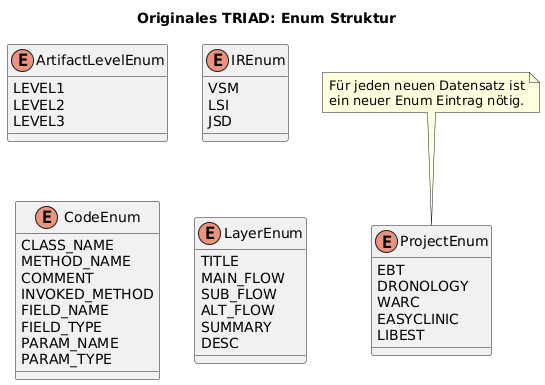
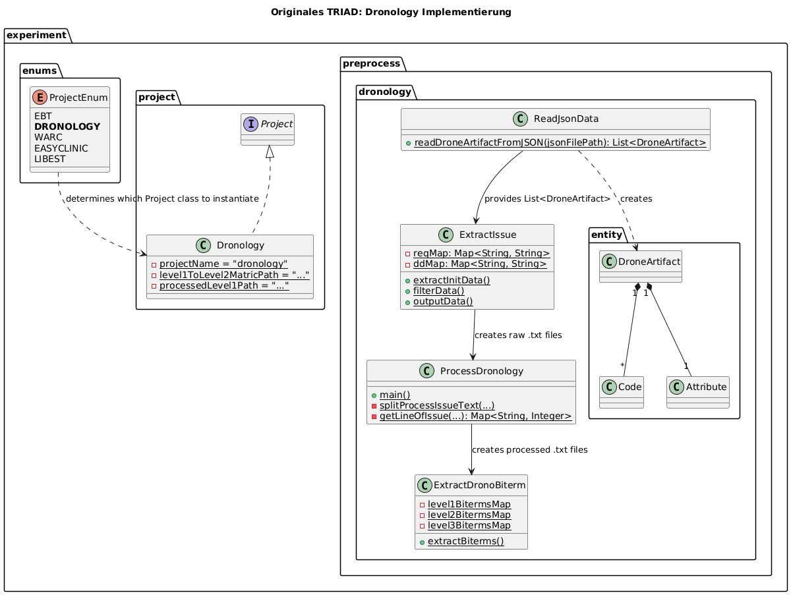

# TRIAD: A Three-Way Approach for Recommending Traceability Links

This project is a modern implementation of the TRIAD traceability link recovery approach, originally presented by **Gao et al.** in their 2024 ICSE paper, "TRIAD: Automated Traceability Recovery based on Biterm-enhanced Deduction of Transitive Links among Artifacts." ([ACM Portal](https://dl.acm.org/doi/10.1145/3597503.3639164)). It reconstructs the methodology described in the paper to provide a reusable and extensible framework for tracing requirements through intermediate artifacts to target artifacts like source code.

## 1. Introduction

Recovering and maintaining traceability links between different software artifacts (e.g., from requirements to design documents to source code) is a critical but labor-intensive task. Automated approaches, typically based on Information Retrieval (IR), have been developed to alleviate this burden. However, traditional two-way methods that directly link high-level requirements to low-level code often struggle due to the significant conceptual and vocabulary gap between these artifacts.

The TRIAD approach, as described by Gao et al., addresses this challenge by leveraging an intermediate artifact set (such as design documents) that bridges the gap. By analyzing the relationships between source, intermediate, and target artifacts, TRIAD enriches the textual content of the artifacts and uses transitive relationships to discover links that would otherwise be missed.

## 2. The TRIAD Approach

The TRIAD pipeline is built upon the idea that intermediate artifacts contain "intermediate-centric consensual biterms"—key term pairs that are central to both the source and target artifacts. By identifying and leveraging these terms, alongside transitive relationships, we can improve the accuracy of traceability link recovery.

### 2.1 Pipeline Overview

The pipeline executes a series of steps to compute a final similarity matrix between source and target artifacts.

1. **Baseline IR Calculation**: A standard IR model (e.g., VSM or LSI) is first used to compute a baseline similarity score between the source and target artifacts. This represents the performance of a traditional two-way tracing method.

2. **Artifact Enrichment**: This is the core of the TRIAD methodology.

   * The system computes similarity matrices between all sets of artifacts (Source-Intermediate, Target-Intermediate, etc.).
   * For each source artifact, it identifies a set of highly similar intermediate artifacts. The biterms from these "neighbor" intermediate artifacts are collected.
   * A consensual biterm is one that appears frequently among the neighbors. These consensual biterms are used to "enrich" the original source artifact by appending them to its text.
   * The same process is performed to enrich target artifacts using their intermediate neighbors.
   * A new, enriched similarity matrix is computed using the enriched source and target artifacts.
3. **Fusion**: The baseline IR matrix and the enriched matrix are fused together. The original paper used a simple average (`0.5 * baseline + 0.5 * enriched`), which is implemented here as the default strategy.
4. **Transitivity**: The final step discovers new links through transitive paths. It calculates the strength of "outer-transitive" paths like `Source -> Intermediate -> Target` and "inner-transitive" paths like `Source -> Similar Source -> Intermediate -> Target`. If a transitive path score is higher than the existing fused score for a given link, the score is updated. This helps uncover non-obvious links.

## 3. Architecture of the Original Implementation

Analyzing the original TRIAD source code reveals an architecture tightly coupled to the specific datasets used in its evaluation. The implementation uses a combination of the Strategy and Factory design patterns, controlled by enums, to manage the distinct processing logic required for each project.

This design choice highlights a key aspect of academic traceability tools: they are often optimized for the known structure of their evaluation datasets.

### 3.1 Project-Specific Control Flow

The control flow is managed by a `ProjectEnum`. Selecting a project via this enum dynamically loads a corresponding project-specific class (e.g., `Dronology.java`, `EasyClinic.java`). Each of these classes implements a shared `Project` interface, which provides paths to the various artifacts and pre-computed data files for that specific project. This structure allows the main execution pipeline to remain generic while delegating the details of data location to concrete strategy classes.

### 3.2 Specialized Pre-processing Pipelines

Crucially, the original implementation does not use a single, generalized pre-processing pipeline. Instead, each project has a dedicated pre-processing package (e.g., `experiment.preprocess.dronology`) containing Java classes written specifically to parse that project's unique artifact formats.

For example, the Dronology pre-processor has logic to identify and parse `[SUMMARY]` and `[DESCRIPTION]` tags, which are specific to its requirements files. In contrast, the EasyClinic processor knows how to parse its unique "Use Case" and "Class Card" text formats. This specialized approach ensures that the textual data fed into the core IR and TRIAD algorithms is of the highest possible quality, as it is tailored to the exact structure of the input.

The diagram below illustrates the specialized pipeline for the Dronology dataset as an example. This tailored processing occurs for every project in the evaluation.

This highly specialized architecture presents both a strength and a challenge. While it maximizes performance on the known datasets, it makes the system difficult to apply to new projects without significant custom development. This observation directly motivated the design of our re-implementation.

## 4. Implementation Challenges & Solutions

Re-implementing an approach from a research paper presents several challenges, especially when aiming for a more generalized and maintainable solution. Our goal was to preserve the core algorithmic contributions of TRIAD while abstracting away from the project-specific pre-processing.

* **Challenge 1: Replicating Biterm Extraction**
  * **Problem**: The original paper's description of biterm extraction was based on specific grammatical rules, but the exact implementation details were ambiguous. Replicating this heuristic-based logic precisely without the source code was infeasible.
  * **Solution**: We implemented a robust and principled biterm extraction pipeline using **Stanford CoreNLP's dependency parsing**. Instead of relying on a fixed set of rules, our approach analyzes the grammatical structure of sentences to identify semantically significant relationships like compound nouns (`compound`), adjectival modifiers (`amod`), and subject-object relations (`nsubj`, `obj`). This captures the *intent* of the original method—finding related pairs of important terms—in a more systematic and reproducible manner.
* **Challenge 2: Parsing Structured Code Artifacts**
  * **Problem**: Treating source code as a simple bag of words is suboptimal, as it ignores crucial structural information. The original implementation likely concatenated identifiers and comments, a process that is difficult to replicate and may not be the most effective.
  * **Solution**: This implementation integrates the **`tree-sitter` parsing framework** to handle Java and C source code. Tree-sitter constructs a concrete syntax tree from the source code, allowing us to precisely extract and assign weights to different elements. For example, class and function names receive a higher weight than local variable names. Comments are also extracted and processed as natural language text. This treats code as a structured document, leading to a higher-quality textual representation for IR analysis.
* **Challenge 3: Ensuring a Fair Comparison and Validation**
  * **Problem**: The smallest differences in text processing pipelines (e.g., stopword lists, stemming algorithms, tokenization rules) can cause significant variations in IR results, making a direct numerical comparison difficult.
  * **Solution**: To validate the core logic of our TRIAD implementation (Enrichment, Fusion, and Transitivity), we created a special `PreprocessedProject` loader. This loader was used for the `Dronology-Original-Preproc` dataset, which contains the exact biterm files produced by the original tool. By feeding our pipeline this pre-computed input, we could bypass our new NLP front-end and verify that the downstream algorithmic components behaved as expected. This approach effectively isolated variables, allowing us to debug and confirm the correctness of the core TRIAD logic separately from the text processing pipeline.
  * **Addendum**: The individual pre-processing of the original implementation offered an additional benefit: it allowed us to build preliminary tests for our new biterm extraction module. We could use the biterms generated by the original tool as a baseline to guide our development. However, this came with a significant caveat: we have no way of knowing if these original biterms are actually reliable or optimal. They are simply the output of one specific toolchain. Therefore, while these comparison tests were invaluable for initial guidance, their usefulness as a definitive "ground truth" is limited.

## 5. Evaluation

The performance of this implementation was evaluated against the datasets and metrics used in the original paper. The primary focus for comparison is the **precision-recall curve**, which shows the trade-off between precision and recall at different retrieval thresholds.

The following plots compare the precision-recall curves of this implementation against the results reported in the original paper. Each plot shows four lines: the baseline (IR-ONLY) and full pipeline (TRIAD) for both the new and original implementations. These graphs visualize the trade-offs between precision and recall and allow for a direct comparison of performance trends.

#### Dronology

#### EasyClinic

#### Warc

## 6. Conclusion

This project successfully re-implements the TRIAD approach using modern, maintainable, and reproducible methods. While the numerical results differ from the original paper due to the challenges in replicating the exact text-processing pipeline, the evaluation confirms the fundamental conclusion of the original work: leveraging intermediate artifacts through enrichment and transitivity significantly improves the performance of traceability link recovery over traditional two-way methods.

## 7. Future Work

While this implementation successfully replicates the core TRIAD algorithm, several avenues exist for future improvement and extension:

* **General Pre-processing**: Develop a more sophisticated general pre-processing module that can intelligently handle different artifact styles without requiring project-specific code. This would improve the out-of-the-box performance on new, unseen datasets and move away from the original implementation's tailored approach.
* **Additional IR Methods**: Integrate and test more IR models. A Jensen-Shannon Divergence (JSD) model was partially implemented but remains buggy. Finalizing it and exploring other modern techniques could yield further performance improvements.
* **Curated Datasets for Testing**: Create a clean, version-controlled dataset that includes the intermediate results of our pipeline (e.g., extracted biterms, processed text). This would provide a trusted baseline for regression testing and make it easier to validate changes to individual components of the system.
* **Expanded Language and Artifact Support**: Extend the `tree-sitter` integration to support more programming languages beyond Java and C. Furthermore, add parsers for other structured artifact formats, such as UML models or XML-based documents, to broaden the applicability of the TRIAD approach.

## Disclaimer

The implementations for the IR models as well as the interface have been copied from the original implementation at https://github.com/huiAlex/TRIAD.git.
